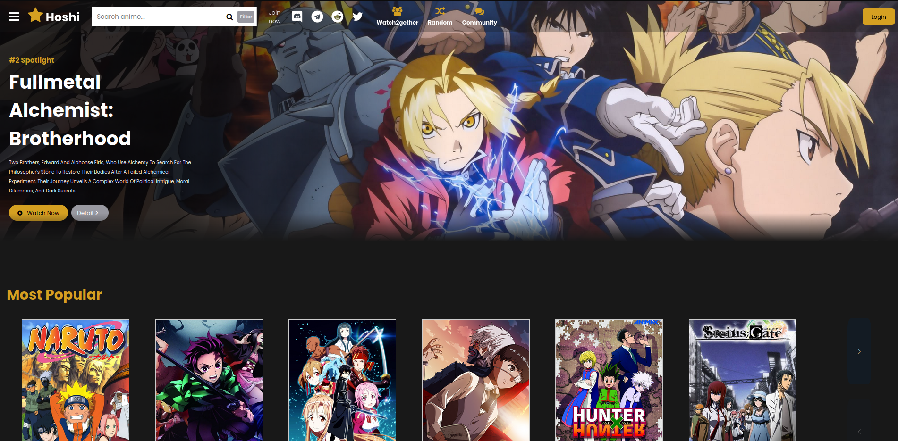
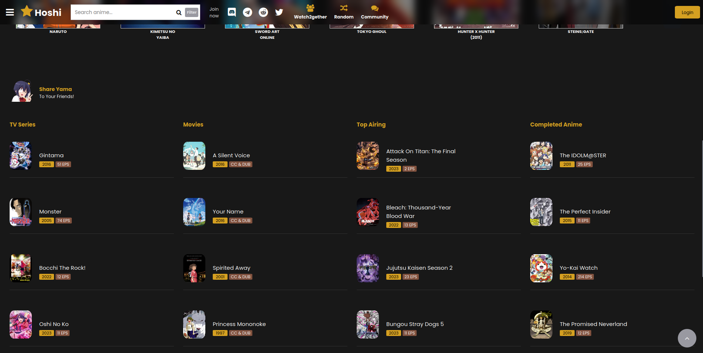

# Anime Streaming Website Landing Page

Welcome to the repository! This little project is an anime streaming website showcase. While it doesn't provide actual streaming functionality, it serves as a visual introduction for a fictional anime streaming platform.

## Preview

## Getting Started

To get started, simply open the `index.html` file in your web browser or access [this link](https://caiohenrique-3.github.io/anime-streaming-landing-page/). Note that this page needs Javascript and a browser that allows canvas reading.

## Contributing

If you'd like to contribute to the development of this landing page, please follow these steps:

1. Fork the repository
2. Create a new branch (`git checkout -b feature`)
3. Make your changes and commit them (`git commit -m 'Add new feature'`)
4. Push to the branch (`git push origin feature`)
5. Open a pull request

## Issues

If you encounter any issues or have suggestions for improvements, please [open an issue](https://github.com/caiohenrique-3/anime-streaming-landing-page/issues).

## Acknowledgments

Special thanks to the following resources for their contributions to this project:

- [DailyWebDesign](https://www.youtube.com/@dailywebdesign), for giving me the [base code](https://dailywebdesigns.com/anime-website-using-html-css-javascript.html) of the header and the anime swipers in my project.
- [AniWatch](https://aniwatch.to/home), because this project is supposed to be a clone of it.
- [Fork Awesome](https://forkaweso.me/Fork-Awesome/)
- [Google Webfonts Helper](https://gwfh.mranftl.com/fonts)
- [Coolors](https://coolors.co/)

## License

This project is licensed under the [MIT License](LICENSE).

## Contact

For inquiries, feel free to open an issue and ask me directly.

---
